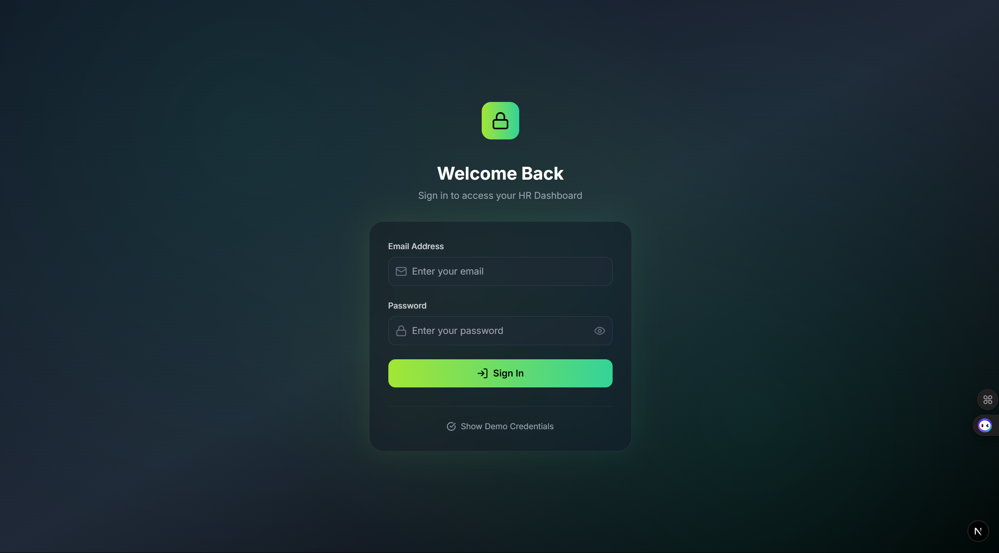
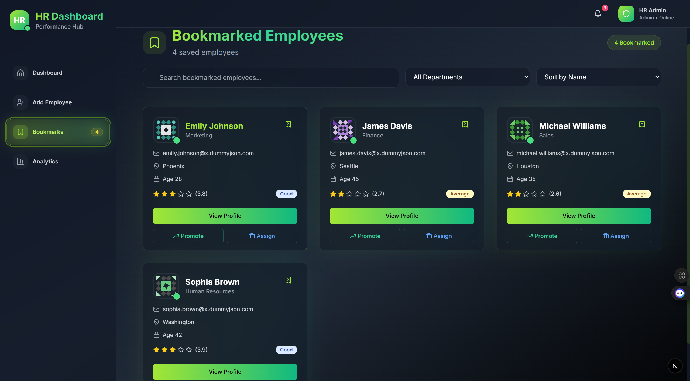
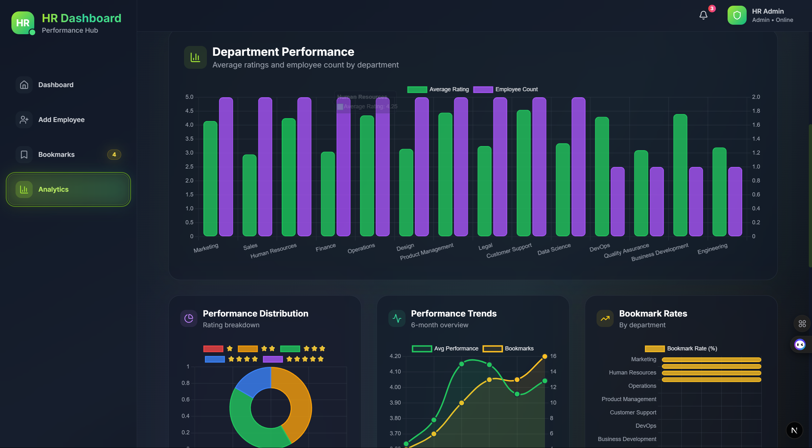

# HR Performance Dashboard

A modern, comprehensive HR Dashboard built with Next.js, React, and Tailwind CSS for managing employee performance, analytics, and team insights. This dashboard empowers HR managers to track employee performance, manage bookmarks, view analytics, and streamline workforce management.


---

## 📸 Application Screenshots

### 🔐 Login Page


### 🏠 Dashboard Homepage


### ➕ Add Employee


### 📌 Bookmarks Management


### 📊 Analytics Dashboard


---

## 🚀 Setup Instructions

### Prerequisites

- **Node.js** (v18+ recommended)
- **npm**, **yarn**, or **pnpm**
- **Git**

### Installation

1. **Clone the repository**
   ```bash
   git clone <your-repository-url>
   cd hr-dashboard
   ```

2. **Install dependencies**
   ```bash
   npm install
   # or
   yarn install
   # or
   pnpm install
   ```

3. **Environment Setup** (Optional)
   Create a `.env.local` file in the root directory:
   ```
   NEXTAUTH_SECRET=your-secret-key-here
   NEXTAUTH_URL=http://localhost:3000
   ```

4. **Run the development server**
   ```bash
   npm run dev
   # or
   yarn dev
   # or
   pnpm dev
   ```

5. **Open your browser**
   Go to [http://localhost:3000](http://localhost:3000)

---

## 🔑 Demo Credentials

**Admin Account:**  
- Email: `admin@hrcompany.com`  
- Password: `admin123`

**Manager Account:**  
- Email: `manager@hrcompany.com`  
- Password: `manager123`

---

## 📋 Features

### 🏠 Dashboard Homepage (`/`)
- Fetches and displays employee data from [dummyjson.com](https://dummyjson.com/users)
- Employee cards: name, email, age, department, job title, rating, actions (View, Bookmark, Promote)
- Real-time stats: average rating, top performers, bookmarks

### 🔍 Search & Filter
- Search by name, email, department, or job title (case-insensitive)
- Filter by department and performance rating (multi-select)
- Real-time, instant filtering

### 👤 Employee Details (`/employee/[id]`)
- Detailed profile: address, phone, bio, performance history
- Star ratings and color-coded badges
- Tabbed UI: Overview, Projects, Feedback (dynamic, mock data)

### ➕ Create Employee (`/create-employee`)
- Multi-section form: personal info, work details, address
- Dynamic job title dropdown based on department
- Form validation and duplicate email prevention
- Success feedback and auto-redirect

### 📌 Bookmark Manager (`/bookmarks`)
- List all bookmarked employees
- Remove from bookmarks, promote, assign to project (UI actions)
- Search and filter within bookmarks

### 📊 Analytics (`/analytics`)
- Charts (Chart.js): department-wise average ratings, performance distribution, trends, bookmark rates
- Department statistics table

### 🔐 Authentication
- NextAuth.js with credentials provider
- Protected routes and role-based access (admin, manager)
- Demo accounts for easy testing

### 🎨 User Experience
- Responsive design (mobile to desktop)
- Dark/Light mode (toggle)
- Loading skeletons and error states
- Smooth Tailwind animations
- Accessible and keyboard-friendly

---

## 🛠 Tech Stack

- **Next.js 15 (App Router)**
- **React 19**
- **Tailwind CSS 3**
- **NextAuth.js 4**
- **Chart.js 4 + react-chartjs-2**
- **Lucide React** (icons)
- **Context API + useReducer** (state management)
- **Custom hooks** (`useEmployees`, `useApp`)
- **Reusable UI components** (Card, Badge, Button, Modal, etc.)

---

## 📁 Project Structure

```
hr-dashboard/
├── app/
│   ├── analytics/         # Analytics page
│   ├── api/auth/          # NextAuth.js API
│   ├── bookmarks/         # Bookmarks page
│   ├── create-employee/   # Create employee page
│   ├── employee/[id]/     # Employee details
│   ├── login/             # Login page
│   ├── globals.css        # Global styles
│   ├── layout.js          # Root layout
│   └── page.js            # Dashboard homepage
├── components/
│   ├── layout/            # Navbar, Sidebar
│   ├── tabs/              # Tabbed content
│   ├── ui/                # UI primitives (badge, button, card, etc.)
│   ├── EmployeeCard.js
│   ├── EmployeeProfileHeader.js
│   ├── EmployeeTabs.js
│   ├── SearchAndFilter.js
│   └── SessionWrapper.js
├── context/
│   └── AppContext.js      # Global state
├── hooks/
│   └── useEmployees.js    # Employee data logic
├── lib/
│   └── utils.js           # Utilities
├── middleware.js          # Auth middleware
├── package.json
└── tailwind.config.js
```

---

## 🧪 Testing Checklist

- [ ] Login with demo credentials
- [ ] Navigate all pages (Dashboard, Bookmarks, Analytics, Create Employee, Employee Details)
- [ ] Test search and filter
- [ ] Create a new employee
- [ ] Bookmark/unbookmark employees
- [ ] View employee details and tabs
- [ ] Test on mobile and desktop
- [ ] Toggle dark mode

---

## 👨‍💻 Author

**Pawan Meena**  
- GitHub: [@pawan09032004](https://github.com/pawan09032004)
- LinkedIn: [Pawan Meena](https://www.linkedin.com/in/pawanmeena-tech/)
- Email: pawanjorwal0903@gmail.com

**Built with ❤️ using Next.js, React, and Tailwind CSS**
